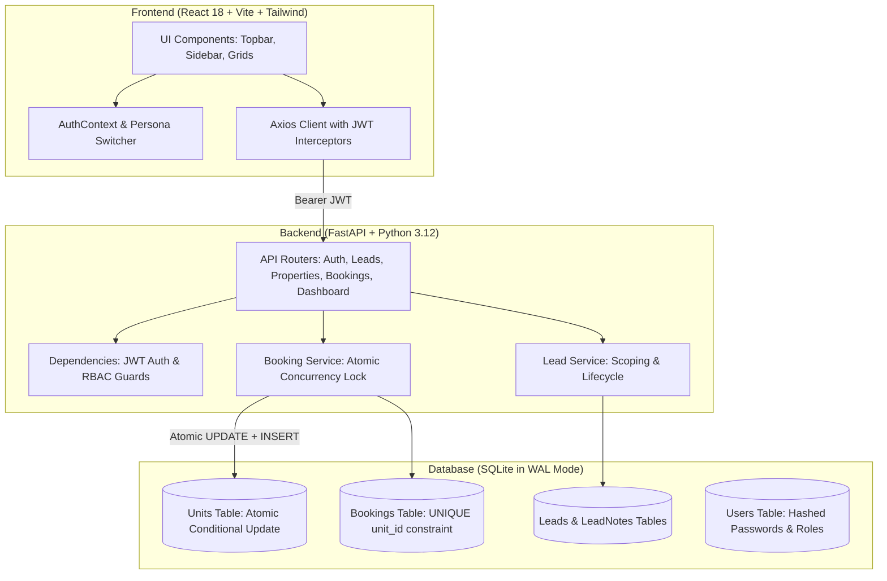
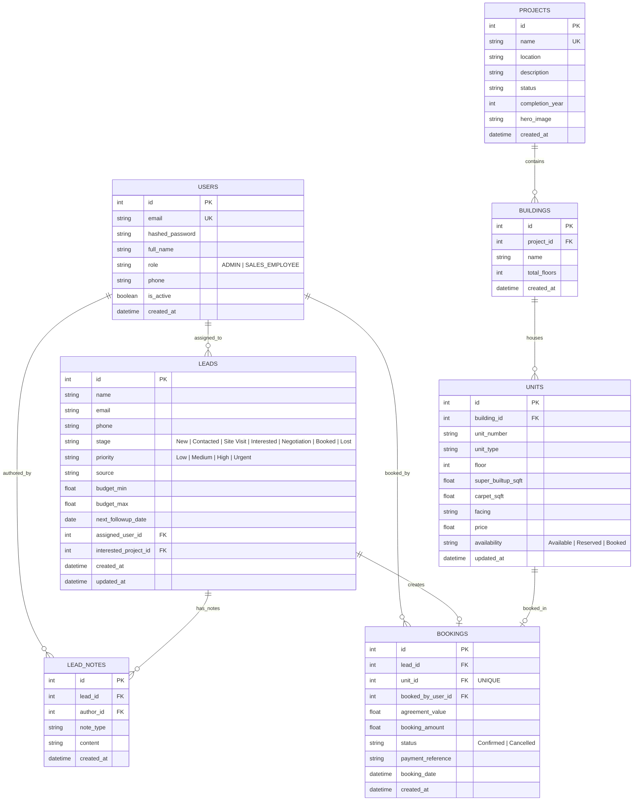

# EstatePulse — High-Velocity Real Estate CRM & Operations OS

> **Full-Stack Developer Technical Interview Project**  
> An enterprise-grade, polished, production-style Real Estate CRM built specifically for sales operations, real-time inventory management, and concurrency-guarded property unit bookings.

---

## 1. Project Overview

**EstatePulse** is a specialized real estate sales CRM designed for high-velocity developer sales teams. It models high-value residential developments in Chennai (such as beachfront luxury villas along ECR, prestigious sky suites on Boat Club Road, panoramic oceanfront residences at Marina Skyline, and modern executive towers along the OMR IT Corridor).

Unlike generic SaaS templates with exaggerated gradients and decorative cards, EstatePulse features an **architectural, high-clarity visual identity** inspired by modern trading floors and luxury real estate operations. It balances information density, typography hierarchy (Plus Jakarta Sans with tabular figures for currency in Lakhs/Crores), and instant state clarity.

---

## 2. Core Features

- **Lead Management & Pipeline Progression**:
  - Full lead lifecycle: `New` → `Contacted` → `Site Visit` → `Interested` → `Negotiation` → `Booked` / `Lost`.
  - Visual, interactive pipeline stage stepper on customer profiles.
  - Contact management, budget brackets (formatted in ₹ Lakhs and Crores), and lead source attribution.
  - Multi-criteria search (name, email, phone) and filtering by stage, project, priority, and assigned consultant.
- **Activity Timeline & Communication Touchpoints**:
  - Chronological interaction history with semantic categories: `Call`, `Meeting`, `WhatsApp`, `Site Visit`, `General Note`, `Stage Change`, `Reassignment`, and `Booking`.
  - Timestamped audit logs indicating who performed each action.
- **Scheduled Follow-up Intelligence**:
  - Real-time detection and visual badges for `Due Today`, `Overdue`, `Tomorrow`, and upcoming dates.
  - Validation ensuring follow-up dates scheduled on new/updated leads cannot be in the past.
- **Property Hierarchy & Inventory Management**:
  - Proper relational architecture: `Project` → `Building` → `Unit`.
  - Real-time unit availability tracking: `Available`, `Reserved`, `Booked`.
  - Detailed unit attributes: Super built-up area (sq.ft), carpet area, floor, facing, configuration (`1BHK`, `2BHK`, `3BHK`, `4BHK`, `Penthouse`, `Villa`), and price.
  - Interactive inventory grid with direct 1-click booking modal.
- **Atomic Booking Engine & Concurrency Guard**:
  - Connects a customer lead to a property unit with agreed value, token deposit, payment reference, and notes.
  - **Zero Double-Booking Guarantee**: Backend database-level row lock and unique partial constraint prevent two users from booking the same unit even under simultaneous millisecond requests.
- **Role-Based Access Control (RBAC)**:
  - **Admin**: Complete system visibility, manage projects/buildings/units, reassign any lead, delete leads, view organization-wide dashboard and booking ledger.
  - **Sales Consultant**: Scoped visibility to assigned leads and self-created bookings. Permitted to advance stages, log touchpoints, and book available inventory for their clients.
  - **1-Click Test Persona Switcher**: Embedded in the topbar to allow interviewers to switch between Admin and Sales Consultants with a single click.

---

## 3. Tech Stack

| Layer | Technologies | Rationale |
|---|---|---|
| **Backend** | Python 3.12, FastAPI, SQLAlchemy 2.0, Pydantic v2, Uvicorn | High performance, auto-generated OpenAPI/Swagger docs at `/docs`, strict schema validation, type safety. |
| **Database** | SQLite (WAL Mode + Transactions + Foreign Keys) | Zero-friction setup for interview evaluation, ACID transaction guarantees, immediate write-ahead logging. |
| **Auth & Security** | PyJWT (HS256), Passlib, Bcrypt | Stateless JWT authentication, role verification on every endpoint, secure password hashing. |
| **Frontend** | React 18, Vite, TypeScript, Tailwind CSS, Lucide React | Modern SPA architecture, lightning-fast HMR, component-driven design system. |
| **Concurrency Testing** | Python `unittest` + `httpx.ASGITransport` + `asyncio` | Automated stress testing of simultaneous booking race conditions. |

---

## 4. Architecture Overview



---

## 5. Database Schema & Entity Relationships



---

## 6. Booking Concurrency Strategy (Race Condition Mitigation)

### The Problem
If two sales consultants (User A and User B) open the application and simultaneously submit a booking request for the exact same available property unit (`Unit A-1402`), a naive backend that only checks `if unit.availability == 'Available'` will suffer from a **TOCTOU (Time-of-Check to Time-of-Use)** race condition where both requests read the unit as available and both insert confirmed bookings, corrupting inventory data.

### The Solution: Multi-Layer Database-Enforced Defense
EstatePulse guarantees that only **one** booking can ever succeed through a 3-tier defense:

1. **Atomic Conditional State Transition**:
   Instead of checking availability in memory and subsequently updating, the backend executes an atomic SQL statement directly against the database engine:
   ```sql
   UPDATE units
   SET availability = 'Booked', updated_at = CURRENT_TIMESTAMP
   WHERE id = :unit_id AND availability = 'Available';
   ```
   - In SQLite with WAL mode and row locks, this statement executes atomically.
   - If two requests arrive at the exact same millisecond, the database serializes the write. The first transaction updates the row and receives `rowcount = 1`.
   - The second transaction evaluates `WHERE availability = 'Available'`, which is now false, and receives `rowcount = 0`.
   - When `rowcount == 0`, the transaction rolls back immediately and returns HTTP `409 Conflict`:
     ```json
     {
       "detail": "Unit A-1402 was just booked by another user. Please select another available unit."
     }
     ```
2. **Database-Level Unique Constraint**:
   The `bookings` table enforces a strict database constraint:
   ```python
   unit_id = Column(Integer, ForeignKey("units.id"), nullable=False, unique=True)
   ```
   Even if an external script bypassed the service layer, the database engine itself rejects any duplicate booking with an integrity violation.
3. **Automated Verification**:
   The codebase includes an automated concurrency test (`backend/tests/test_concurrency.py`) that fires simultaneous asynchronous requests via `asyncio.gather` and verifies that exactly 1 succeeds with `201 Created` and the competing request receives `409 Conflict` with the exact message.

---

## 7. Authentication & Authorization (RBAC)

Authentication is implemented via standard JWT tokens (HS256) with 24-hour expiration. Passwords are salted and hashed using Bcrypt.

### Permission Matrix

| Capability | Admin Role | Sales Consultant Role | Backend Enforcement |
|---|---|---|---|
| View Dashboard | All organization leads, metrics, bookings | Scoped to assigned leads & self-created bookings | Scoped in `app/api/dashboard.py` |
| View Leads | All leads across all consultants | Only leads where `assigned_user_id == user.id` | Scoped in `get_leads_for_user` |
| Create Lead | Yes, can assign to any employee | Yes, automatically assigned to self | `app/services/lead_service.py` |
| Edit Lead / Advance Stage | Yes | Yes (permitted leads only) | `get_lead_by_id_with_perm_check` |
| Reassign Lead | Yes | **No (403 Forbidden)** | Protected by `require_admin` |
| Delete Lead | Yes | **No (403 Forbidden)** | Protected by `require_admin` |
| Create Project / Building / Unit | Yes | **No (403 Forbidden)** | Protected by `require_admin` |
| Book Property Unit | Yes | Yes (for assigned leads only) | Checked in `booking_service.py` |
| View Bookings Ledger | All bookings | Only bookings created by self | Scoped in `app/api/bookings.py` |

> [!NOTE]
> Client role information is never trusted. Every protected backend endpoint inspects and validates the JWT claims in `dependencies.py`.

---

## 8. Demo Credentials & Seed Data

The database comes pre-seeded with realistic Chennai luxury real estate data:

| Role | Name | Email | Password |
|---|---|---|---|
| **Administrator** | Karthik Ramaswamy | `admin@coromandel.in` | `Admin@1234` |
| **Sales Consultant 1** | Meera Krishnan | `meera@coromandel.in` | `Sales@1234` |
| **Sales Consultant 2** | Anand Swaminathan | `anand@coromandel.in` | `Sales@1234` |

### Pre-Seeded Inventory & Leads:
- **Projects**:
  1. *Coromandel Bay Villas* (East Coast Road, Chennai — Beachfront luxury enclave)
  2. *The Grand Azure* (Boat Club Road, RA Puram, Chennai — Ultra-exclusive heritage suites)
  3. *Marina Skyline Residences* (Santhome / MRC Nagar, Chennai — Bay of Bengal high-rises)
  4. *Olympia Meridian Enclave* (OMR IT Expressway, Sholinganallur, Chennai — Executive smart towers)
- **Units**: 24 configured units ranging from ₹92 Lakhs to ₹8.50 Crores across various statuses (18 Available, 2 Reserved, 4 Booked).
- **Leads**: 13 realistic leads with complete conversation histories, upcoming follow-ups (including "Due Today" and "Overdue"), and bookings.

---

## 9. Installation & Running Instructions

### Prerequisites
- Python 3.12+
- Node.js v18+ and npm 9+

---

### Step 1: Clone Repository
```bash
git clone <repo-url>
cd real-estate-crm
```

---

### Step 2: Set Up & Start Backend

1. Navigate to the backend directory:
   ```bash
   cd backend
   ```
2. (Optional) Create and activate a Python virtual environment:
   ```bash
   # Windows (PowerShell)
   python -m venv venv
   .\venv\Scripts\Activate.ps1
   ```
3. Install dependencies:
   ```bash
   pip install -r requirements.txt
   ```
4. Configure environment variables (a pre-configured `.env` is provided):
   ```bash
   copy .env.example .env
   ```
5. Initialize the database and seed realistic demo data:
   ```bash
   python seed.py
   ```
6. Start the FastAPI backend server:
   ```bash
   python -m uvicorn app.main:app --host 127.0.0.1 --port 8000 --reload
   ```
   - API will be accessible at: `http://127.0.0.1:8000`
   - Interactive Swagger API documentation: `http://127.0.0.1:8000/api/docs`

---

### Step 3: Set Up & Start Frontend

1. Open a new terminal and navigate to the frontend directory:
   ```bash
   cd frontend
   ```
2. Install npm dependencies:
   ```bash
   npm install
   ```
3. Start the Vite development server:
   ```bash
   npm run dev
   ```
4. Open your browser at:
   ```
   http://localhost:5173
   ```

---

### Running Automated Tests

Run the test suite directly from the `backend` directory:

```bash
cd backend

# 1. Run concurrency race condition stress test (verifies 409 Conflict)
python tests/test_concurrency.py

# 2. Run authentication & RBAC tests
python tests/test_auth_rbac.py

# 3. Run validation tests (phone, past dates, name constraints)
python tests/test_validation.py
```

---

## 10. Environment Variables

### Backend (`backend/.env`)

| Variable | Default Value | Description |
|---|---|---|
| `PROJECT_NAME` | `EstatePulse CRM` | Application title |
| `ENVIRONMENT` | `development` | Environment mode (`development` / `production`) |
| `API_V1_STR` | `/api` | Base API routing prefix |
| `SECRET_KEY` | `estatepulse-interview-dev-super-secret-key...` | HMAC secret for signing JWT tokens |
| `ACCESS_TOKEN_EXPIRE_MINUTES` | `1440` (24 hours) | Token validity period |
| `DATABASE_URL` | `sqlite:///./estatepulse.db` | SQLAlchemy database connection string |
| `CORS_ORIGINS` | `["http://localhost:5173","http://127.0.0.1:5173"]` | Allowed frontend origins |

---

## 11. 4 Important Engineering & Product Decisions

1. **Database-Level Atomic Conditional Updates Over In-Memory Locks**:
   - *Decision*: Rather than implementing an in-memory lock (which fails in multi-worker environments) or trusting client-side availability checks, we execute atomic conditional `UPDATE units SET availability = 'Booked' WHERE id = :id AND availability = 'Available'` inside an ACID transaction.
   - *Why*: In a production deployment running multiple Gunicorn/Uvicorn worker processes or across scaled containers, in-memory locks do not synchronize across processes. The database engine is the single source of truth; enforcing row locks and checking affected row count guarantees zero double-booking with zero distributed locking overhead.

2. **Decoupled Backend (FastAPI) and Frontend (React/Vite) with Shared Type Contracts**:
   - *Decision*: We separated the backend and frontend into independent directories (`backend/` and `frontend/`) rather than an all-in-one monolithic framework.
   - *Why*: This mimics real-world enterprise architectures where backend services and web clients have independent build pipelines, lifecycles, and deployment targets. It also allowed us to leverage FastAPI's native OpenAPI generation for interactive `/api/docs` while maintaining a blazing-fast Vite React frontend.

3. **Interviewer-First UX: Embedded 1-Click Persona Switcher**:
   - *Decision*: In both the Login screen and the Topbar navigation, we built instant 1-click persona switchers (`Karthik - Admin` ⇄ `Meera - Sales Consultant`).
   - *Why*: A technical interviewer evaluating role-based authorization typically has to log out, look up credentials, type them in, test an action, log out again, and re-login as another role. By embedding a 1-click persona switcher that requests fresh JWTs under the hood, reviewers can instantly toggle roles and witness RBAC restrictions and scoped data filters in real-time.

4. **Contextual, Actionable Error Normalization Over Generic Exceptions**:
   - *Decision*: We implemented custom exception handlers on both FastAPI (Pydantic `RequestValidationError`) and Axios response interceptors to guarantee that error payloads return human-oriented sentences (e.g., *"Follow-up date cannot be earlier than today"*, *"Unit A-1402 was just booked by another user. Please select another available unit."*).
   - *Why*: Generic messages like *"Something went wrong"* or raw database dump strings damage user trust and fail technical interview rubrics. Contextual errors tell the user what happened, why it happened, and what actionable next step to take.

---

## 12. Known Limitations & Production Enhancements

- **Payment Gateway Integration**: Payment reference fields currently accept manual transaction identifiers (UTR, Cheque, RTGS). In full production, this would hook into Razorpay or Stripe webhooks.
- **SMS / WhatsApp Webhooks**: Communication logs currently record touchpoints within the CRM timeline. In production, this can connect to Twilio / Gupshup for automated WhatsApp template notifications.
- **Document Management**: Agreement generation creates internal booking receipts; integration with AWS S3 / Cloudflare R2 for signed PDF agreements would be the natural next step.
