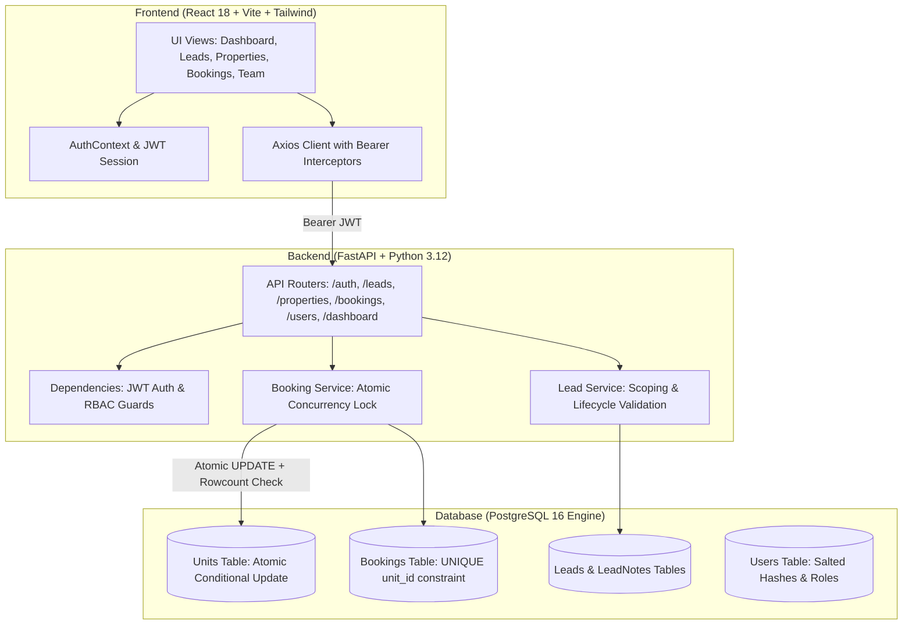
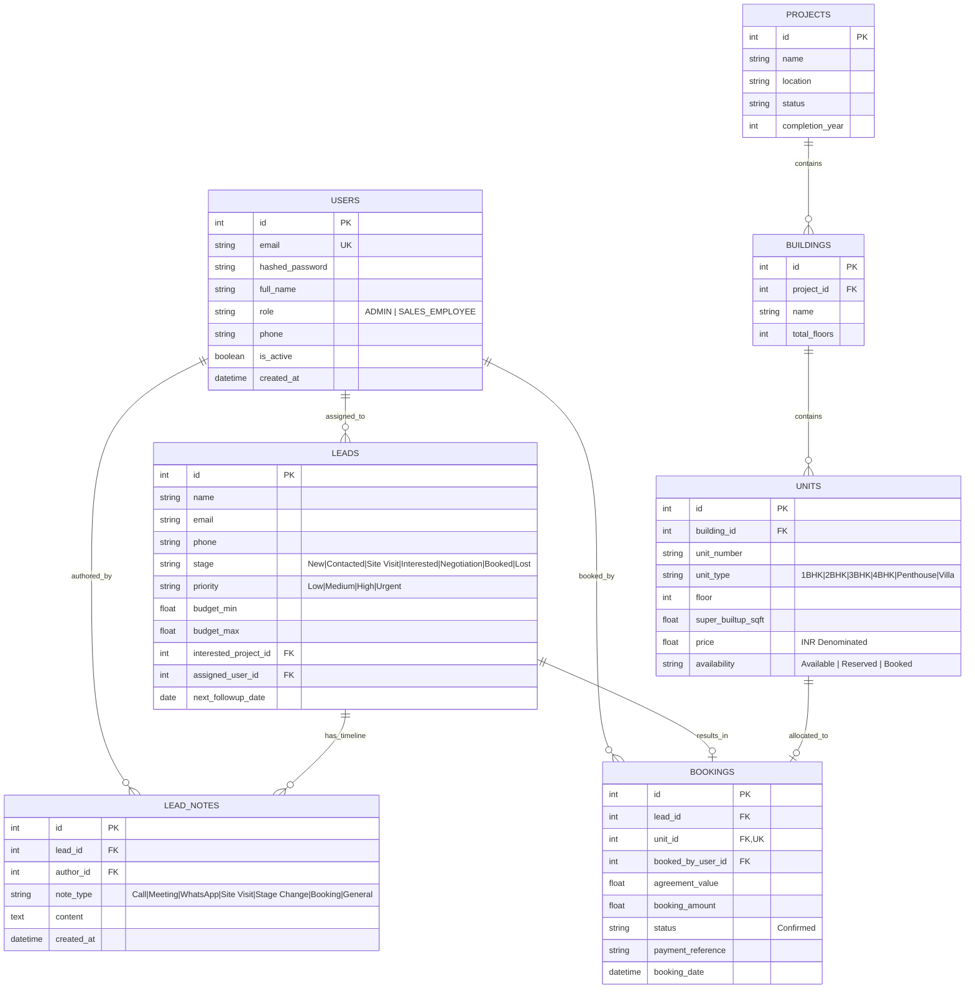

# EstatePulse - High-Velocity Real Estate CRM & Operations OS

> **Full-Stack Developer Technical Interview Project**  
> An enterprise-grade, production-style Real Estate CRM built specifically for luxury developer sales operations, real-time inventory allocation, and concurrency-guarded property unit bookings.
>
> 🔗 **GitHub Repository**: [https://github.com/Yogesh-kk49/Real_estate_CRM](https://github.com/Yogesh-kk49/Real_estate_CRM)

---

## 1. Project Overview

**EstatePulse** is a specialized real estate sales CRM engineered for high-velocity property developers and sales teams. It models residential luxury developments in Chennai (such as beachfront luxury villas along ECR, sky suites on Boat Club Road, panoramic oceanfront residences at Marina Skyline, and modern executive towers along the OMR IT Corridor).

EstatePulse features an **architectural, high-contrast, clean visual identity** (warm linen canvas, crisp white cards, bold slate typography, and architectural terracotta accents). It prioritizes information density, strict typography hierarchy (Plus Jakarta Sans with tabular figures for currency in Lakhs/Crores), and instant state clarity.

---

## 2. Core Features & Business Highlights

### 📋 Lead Pipeline & Lifecycle Progression
- **7-Stage Pipeline**: Systematic progression: `New` → `Contacted` → `Site Visit` → `Interested` → `Negotiation` → `Booked` / `Lost`.
- **Interactive Lifecycle Stepper**: 1-click stage advancement directly from the customer's 360° profile view.
- **Budget & Preference Tracking**: Budgets formatted cleanly in Indian denomination (₹ Lakhs and Crores).
- **Search & Multi-Filter**: Real-time filtering by lead stage, property interest, priority, and assigned sales consultant.

### 🛡️ Concurrency-Guarded Booking Engine (Zero Double-Booking)
- **Atomic Database Locks**: Connects buyer leads to property units with agreed value, token deposit, payment reference, and contract notes.
- **Zero Double-Booking Guarantee**: Backend conditional row updates (`WHERE id = :id AND availability = 'Available'`) and unique constraints prevent two consultants from booking the same unit, returning clean **HTTP 409 Conflict** errors with user-friendly resolution prompts.

### 👥 Staff Recruitment & Delegation (Admin-Only)
- **Recruit Sales Staff**: Administrators can onboard new sales consultants by providing their full name, work email (or Gmail), mobile number, and initial password.
- **Staff-Only Role Protection**: The recruitment workflow is strictly locked to create **Sales Consultants (`SALES_EMPLOYEE`)** only, preventing unauthorized admin escalation.
- **Lead Delegation & Reassignment**: Admins can distribute unassigned or existing buyer leads to newly recruited consultants.
- **Access Control**: Instant account deactivation and reactivation controls.

### 🏢 Relational Property Hierarchy & Live Matrix
- **Relational Schema**: `Project` → `Building` → `Unit`.
- **Inventory Matrix**: Tracks floors, super built-up area (sq.ft), carpet area, facing direction, and configuration (`1BHK`, `2BHK`, `3BHK`, `4BHK`, `Penthouse`, `Villa`).
- **Real-Time Unit States**: Color-coded badges for `Available`, `Reserved`, and `Booked`.

### ⏱️ 360° Interaction Audit Trail & Follow-up Intelligence
- **Interaction Logs**: Chronological timeline covering `Phone Call`, `Meeting`, `WhatsApp Message`, `Site Visit`, `General Note`, `Stage Change`, and `Unit Booking`.
- **Urgency Classification**: Automated badges highlighting `Due Today`, `Overdue`, and upcoming consultations.
- **Past-Date Validation**: Ensures scheduled follow-up touchpoints cannot be placed in the past.

### 🔐 Role-Based Access Control (RBAC) & Secure Authentication
- **Executive Admin**: Full organization-wide oversight, staff recruitment, property configuration, and cross-portfolio analytics.
- **Sales Consultant**: Scoped visibility limited strictly to assigned leads and self-booked units.
- **Dedicated User Profile Pill**: Indicates the current active account, first name, and role badge (Admin in Amber, Sales in Emerald).
- **Secure Sign Out Flow**: Confirmation dialog before ending sessions and automatic clearance of JWT authentication tokens.

---

## 3. Demo Access Credentials

| Role | Email | Password | Scope & Privileges |
|---|---|---|---|
| **Administrator** | `admin@coromandel.in` | `Admin@1234` | Full system control, recruit sales consultants, manage all leads & inventory |
| **Sales Consultant** | `meera@coromandel.in` | `Sales@1234` | Scoped consultant workspace, manage assigned leads, execute bookings |
| **Sales Consultant** | `anand@coromandel.in` | `Sales@1234` | Scoped consultant workspace, manage assigned leads, execute bookings |

> 💡 **Quick Sign-In**: The Login screen features an on-demand modal with convenient `[Load Admin]` and `[Load Staff]` helper buttons for instant evaluation without manual typing.

---

## 4. Tech Stack

| Layer | Technologies | Rationale |
|---|---|---|
| **Backend** | Python 3.12, FastAPI, SQLAlchemy 2.0, Pydantic v2, Uvicorn | High performance, auto-generated OpenAPI/Swagger documentation at `/api/docs`, strict validation guards. |
| **Database** | PostgreSQL (Render Cloud / Neon) | Cloud-persistent PostgreSQL for zero-cost production hosting; ACID transactions, connection pooling, and atomic row-level locks. |
| **Auth & Security** | PyJWT (HS256), Passlib, Bcrypt | Stateless JWT bearer tokens, role verification dependencies, salted password hashing. |
| **Frontend** | React 18, Vite, TypeScript, Tailwind CSS, Lucide React | Modern SPA architecture, lightning-fast HMR, high-contrast accessible design system. |
| **Testing** | Python `unittest` + `httpx.ASGITransport` + `asyncio` | Automated concurrency stress tests, RBAC access tests, and validation constraint tests. |

---

## 5. System Architecture



---

## 6. Database Schema & Entity Relationships



---

## 7. Concurrency Guard Deep-Dive (Solving the Double-Booking Problem)

In luxury real estate sales, multiple agents frequently negotiate with different high-net-worth buyers simultaneously. If two agents click "Confirm Booking" on the same prime villa at the exact same millisecond:

```
Agent 1 (Meera):  POST /api/bookings (Unit #1 - Coromandel Ocean Villa)
Agent 2 (Anand):  POST /api/bookings (Unit #1 - Coromandel Ocean Villa)
```

### The Solution:
Rather than relying on in-memory locks or naive client checks, EstatePulse executes an **atomic conditional UPDATE** inside a transaction:

```python
# backend/app/services/booking_service.py
result = db.execute(
    update(Unit)
    .where(Unit.id == unit_id, Unit.availability == UnitAvailability.AVAILABLE.value)
    .values(availability=UnitAvailability.BOOKED.value)
)

if result.rowcount == 0:
    db.rollback()
    raise HTTPException(
        status_code=status.HTTP_409_CONFLICT,
        detail=f"Unit {unit.unit_number} was just booked by another agent. Please select another available unit."
    )
```

1. The first request updates the unit row from `Available` to `Booked` and proceeds.
2. The second simultaneous request matches `rowcount == 0`, rolls back, and returns **HTTP 409 Conflict**.
3. A unique database index on `bookings.unit_id` serves as a secondary guarantee.

---

## 8. Free Cloud Hosting Guide (100% on Render: PostgreSQL + Backend + Frontend)

You can host the entire system permanently on **Render** with zero credit card required:

```
┌─────────────────────────────────────────────────────────────────────────┐
│                             RENDER CLOUD                                │
│                                                                         │
│   ┌────────────────────────┐         ┌──────────────────────────────┐   │
│   │    Render Frontend     │         │        Render Backend        │   │
│   │  React 18 + Vite SPA   │────────▶│      FastAPI Web Service     │   │
│   │   (Static Site - Free) │         │     (Python 3.12 - Free)     │   │
│   └────────────────────────┘         └──────────────┬───────────────┘   │
│                                                     │                   │
│                                                     ▼                   │
│                                      ┌──────────────────────────────┐   │
│                                      │      Render PostgreSQL       │   │
│                                      │     Managed Cloud DB (Free)  │   │
│                                      └──────────────────────────────┘   │
└─────────────────────────────────────────────────────────────────────────┘
```

### Option A: 1-Click Render Blueprint (Recommended)

The repository includes a pre-configured [`render.yaml`](file:///render.yaml) Blueprint that sets up PostgreSQL, the FastAPI Backend, and the React Frontend simultaneously:

1. Push your changes to GitHub: `https://github.com/Yogesh-kk49/Real_estate_CRM`.
2. Go to [https://dashboard.render.com](https://dashboard.render.com) and sign in.
3. Click **New +** → **Blueprint**.
4. Select your GitHub repository: `Real_estate_CRM`.
5. Render will automatically read `render.yaml` and provision:
   - **`estatepulse-db`**: Free PostgreSQL database.
   - **`estatepulse-backend`**: Free Python FastAPI web service connected directly to the database.
   - **`estatepulse-frontend`**: Free React static site connected directly to the backend.
6. Click **Apply**.
7. *That's it!* On initial launch, the backend automatically detects the fresh PostgreSQL database and seeds the demo **Administrator** (`admin@coromandel.in` / `Admin@1234`) and **Sales Staff** (`meera@coromandel.in` / `Sales@1234`) accounts automatically.

---

### Option B: Manual Setup on Render (Step-by-Step)

If you prefer to configure each component manually in the Render Dashboard:

#### Step 1: Create Free PostgreSQL Database on Render
1. In Render Dashboard, click **New +** → **PostgreSQL**.
2. **Name**: `estatepulse-db`
3. **Database**: `estatepulse`
4. **User**: `estatepulse_user`
5. **Plan**: `Free`
6. Click **Create Database**.
7. Once created, copy the **Internal Database URL** (or External Database URL).

#### Step 2: Deploy Backend Web Service
1. Click **New +** → **Web Service**.
2. Select your repository `Real_estate_CRM`.
3. Settings:
   - **Name**: `estatepulse-backend`
   - **Root Directory**: `backend`
   - **Runtime**: `Python 3`
   - **Build Command**: `pip install -r requirements.txt`
   - **Start Command**: `uvicorn app.main:app --host 0.0.0.0 --port $PORT`
   - **Instance Type**: `Free`
4. **Environment Variables**:
   - `DATABASE_URL`: *(Paste your Render PostgreSQL connection string)*
   - `SECRET_KEY`: `estatepulse-interview-dev-super-secret-key-change-in-prod`
   - `ENVIRONMENT`: `production`
   - `CORS_ORIGINS`: `*`
5. Click **Deploy Web Service**.
6. Copy your public backend URL (e.g. `https://estatepulse-backend.onrender.com`).

#### Step 3: Deploy Frontend Static Site
1. Click **New +** → **Static Site**.
2. Select your repository `Real_estate_CRM`.
3. Settings:
   - **Name**: `estatepulse-frontend`
   - **Root Directory**: `frontend`
   - **Build Command**: `npm install && npm run build`
   - **Publish Directory**: `dist`
4. **Environment Variables**:
   - `VITE_API_URL`: `https://estatepulse-backend.onrender.com/api` *(replace with your Render backend URL + `/api`)*
5. **Routes / Redirects**:
   - Add a rewrite rule: Source `/*` → Destination `/index.html` (Status: `Rewrite`).
6. Click **Create Static Site**.

---

### Verification:
1. Open your `estatepulse-frontend.onrender.com` URL.
2. The landing page loads with the full luxury design.
3. Click **Sign In** and use **Load Admin** (`admin@coromandel.in`) or **Load Staff** (`meera@coromandel.in`).
4. You are securely signed in and connected to your persistent cloud PostgreSQL database!

---

## 9. Local Installation & Quick Start

### Prerequisites
- **Node.js** v18+ (tested on Node v20/v22)
- **Python** 3.10+ (tested on Python 3.12)
- **Git**

---

### Step 1: Clone the Repository
```bash
git clone https://github.com/Yogesh-kk49/Real_estate_CRM.git
cd Real_estate_CRM
```

---

### Step 2: Backend Setup & Seeding

1. Open a terminal and navigate to the backend directory:
   ```powershell
   cd backend
   ```
2. Install Python dependencies:
   ```powershell
   pip install -r requirements.txt
   ```
3. Initialize the database and seed demo data:
   ```powershell
   python seed.py
   ```
   *(Seeds 3 demo users, 4 Chennai luxury projects, 24 units, 13 leads with interaction timelines, and 4 confirmed bookings).*

4. Start the FastAPI backend server:
   ```powershell
   python -m uvicorn app.main:app --host 127.0.0.1 --port 8000 --reload
   ```
   - API endpoint: `http://127.0.0.1:8000`
   - Interactive Swagger API documentation: `http://127.0.0.1:8000/api/docs`

---

### Step 3: Frontend Setup & Launch

1. In a **second terminal**, navigate to the frontend directory:
   ```powershell
   cd frontend
   ```
2. Install dependencies:
   ```powershell
   npm install
   ```
3. Start the Vite development server:
   ```powershell
   npm run dev
   ```
4. Open your browser:
   ```
   http://localhost:5173
   ```

---

### Windows One-Click Quick Launch
If you are on Windows, simply double-click the root batch file:
```cmd
run_dev.bat
```
*(Automatically verifies dependencies, seeds the database if needed, and launches both backend and frontend servers in separate windows).*

---

## 10. Running Automated Test Suite

Run the full automated test suite directly from the `backend` directory:

```powershell
cd backend

# 1. Test concurrency race conditions (confirms 201 Created & 409 Conflict)
python tests/test_concurrency.py

# 2. Test authentication & RBAC isolation (confirms 403 Forbidden & scoped queries)
python tests/test_auth_rbac.py

# 3. Test input validations (phone formatting, past follow-up dates, name constraints)
python tests/test_validation.py
```

---

## 11. API Endpoints Reference

| Category | Method | Endpoint | Access | Description |
|---|---|---|---|---|
| **Auth** | `POST` | `/api/auth/login` | Public | Authenticate with email/password and obtain JWT token |
| **Auth** | `GET` | `/api/auth/me` | Authenticated | Retrieve profile of the currently signed-in user |
| **Users** | `GET` | `/api/users/employees` | Authenticated | List active sales consultants for assignment dropdowns |
| **Users** | `GET` | `/api/users` | Admin Only | List all team accounts and assigned lead counts |
| **Users** | `POST` | `/api/users` | Admin Only | Recruit a new sales consultant (`SALES_EMPLOYEE` only) |
| **Users** | `PATCH`| `/api/users/{id}` | Admin Only | Update staff profile or activate/deactivate account |
| **Leads** | `GET` | `/api/leads` | RBAC Scoped | List leads (filtered automatically for sales consultants) |
| **Leads** | `POST` | `/api/leads` | Sales / Admin | Create a new lead with follow-up validation |
| **Leads** | `GET` | `/api/leads/{id}` | RBAC Scoped | Retrieve full 360° lead detail and interaction timeline |
| **Leads** | `PATCH`| `/api/leads/{id}` | RBAC Scoped | Update lead contact details, stage, or notes |
| **Leads** | `POST` | `/api/leads/{id}/notes`| RBAC Scoped | Log a new client touchpoint (Call, Meeting, WhatsApp) |
| **Leads** | `POST` | `/api/leads/{id}/assign`| Admin Only | Reassign a lead to another sales consultant |
| **Properties** | `GET` | `/api/properties/projects` | Authenticated | List luxury developments with unit availability stats |
| **Properties** | `GET` | `/api/properties/units` | Authenticated | Filter inventory units by project, floor, and status |
| **Bookings** | `POST` | `/api/bookings` | Sales / Admin | Atomic concurrency-guarded property booking |
| **Bookings** | `GET` | `/api/bookings` | RBAC Scoped | List confirmed booking ledger agreements |
| **Dashboard** | `GET` | `/api/dashboard/stats` | RBAC Scoped | Real-time KPIs, pipeline funnel, follow-up alerts |

---

## 12. Key Engineering & Product Decisions

1. **Database-Level Atomic Conditional Updates Over In-Memory Locks**:
   - In-memory locks fail when scaling across multiple worker processes or containers. By performing conditional `UPDATE` statements inside database transactions and checking affected row counts, we guarantee zero double-booking with zero distributed locking overhead.

2. **Decoupled Modern Architecture**:
   - Backend (FastAPI) and Frontend (React/Vite) have separate concerns and clean contracts. FastAPI generates compliant OpenAPI documentation at `/api/docs`, while Vite powers a responsive, type-safe React client.

3. **Strict Staff-Only Recruitment**:
   - Administrators can onboard and recruit sales consultants (`SALES_EMPLOYEE`), but the recruitment interface and API schema strictly prohibit creating additional administrators, safeguarding organizational privilege hierarchy.

4. **Production-Ready PostgreSQL with Connection Pooling**:
   - Configured with SQLAlchemy connection recycling and pre-pinging, enabling zero-config deployment to serverless and hosted PostgreSQL clusters like Neon or AWS RDS while retaining local fallback capability.

5. **Contextual Error Handling**:
   - Both Pydantic schema validation errors and backend exceptions are normalized into actionable, user-friendly sentences instead of raw stack traces or ambiguous errors.

---

## 13. License

Developed for evaluation and demonstration purposes. All rights reserved © 2026 EstatePulse.
