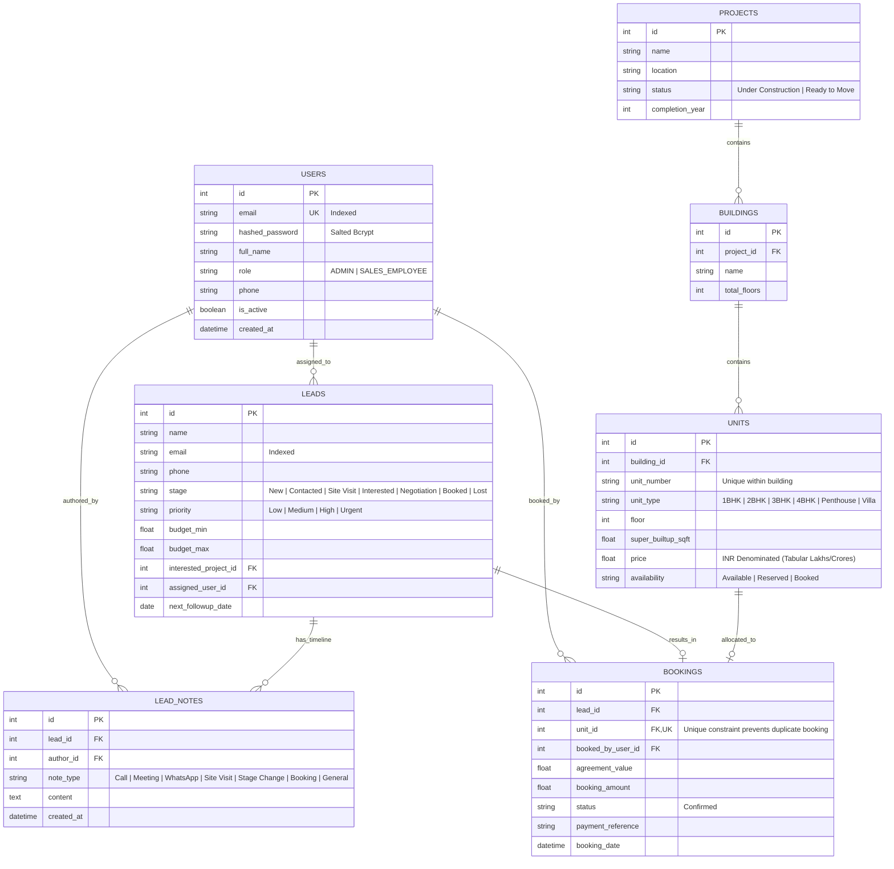

# EstatePulse CRM — Database & API Architecture Overview

> **Technical Interview Project Submission**  
> **Candidate**: Yogesh  
> **Repository**: [https://github.com/Yogesh-kk49/Real_estate_CRM](https://github.com/Yogesh-kk49/Real_estate_CRM)  
> **Live Application**: [https://real-estate-crm-5k5j.onrender.com](https://real-estate-crm-5k5j.onrender.com)  
> **Live Backend API**: [https://estatepulse-backend-56wz.onrender.com](https://estatepulse-backend-56wz.onrender.com)  
> **Interactive Swagger Documentation**: [https://estatepulse-backend-56wz.onrender.com/api/docs](https://estatepulse-backend-56wz.onrender.com/api/docs)

---

## 1. Executive Summary & Live Access

**EstatePulse** is a specialized, production-style real estate operations and sales CRM engineered for high-velocity luxury property developments in Chennai (ECR beach villas, Boat Club sky suites, Marina oceanfront residences, OMR executive towers).

### Live Demo Accounts

| Role | Email | Password | Scope & Privileges |
|---|---|---|---|
| **System Administrator** | `admin@coromandel.in` | `Admin@1234` | Full portfolio oversight, staff recruitment, all lead assignments, inventory controls |
| **Sales Consultant (Staff)** | `meera@coromandel.in` | `Sales@1234` | Scoped lead portfolio, customer timelines, scheduled follow-ups, unit bookings |
| **Sales Consultant (Staff)** | `anand@coromandel.in` | `Sales@1234` | Scoped lead portfolio, customer timelines, scheduled follow-ups, unit bookings |

*(The live login page also includes 1-click **Load Admin** and **Load Staff** helper buttons for instant reviewer evaluation).*

---

## 2. Database Architecture (PostgreSQL 16)

The application uses **PostgreSQL 16** managed cloud database on Render with SQLAlchemy 2.0 ORM, featuring connection pooling (`pool_pre_ping=True`, `pool_recycle=300`), strict foreign key constraints, and row-level atomic locks.

### Entity-Relationship Diagram (ERD)



### Table Definitions & Key Constraints

1. **`users`**:
   - `email`: `VARCHAR`, `UNIQUE`, `NOT NULL`, indexed.
   - `role`: Restricted to `ADMIN` or `SALES_EMPLOYEE`.
   - `hashed_password`: Salted 12-round bcrypt hash (passwords safely limited to 72 bytes).

2. **`properties` (Projects, Buildings, Units)**:
   - 3-level hierarchical relationship: `Project` (1:N) → `Building` (1:N) → `Unit`.
   - `units.availability`: State machine: `Available` → `Reserved` → `Booked`.

3. **`leads` & `lead_notes`**:
   - `leads.stage`: Strict 7-stage lifecycle state machine.
   - `leads.assigned_user_id`: Foreign key linked to `users.id` (powers RBAC query scoping).
   - `lead_notes`: Immutable chronological audit log with author tracking and note classifications.

4. **`bookings`**:
   - `unit_id`: **`UNIQUE CONSTRAINT`** — prevents any property unit from being booked more than once at the relational schema level.
   - `lead_id`: Foreign key linked to the buyer lead.
   - `booked_by_user_id`: Tracks the sales consultant who executed the agreement.

---

## 3. Concurrency Guard: Zero Double-Booking Architecture

In luxury real estate sales, multiple agents frequently negotiate with different buyers simultaneously. If two agents click **"Confirm Booking"** on the same prime villa at the exact same millisecond, standard application logic often results in double-allocations.

EstatePulse solves this using a **two-layer database guard**:

```
Agent 1 (Meera):  POST /api/bookings (Unit #1 - Coromandel Ocean Villa)  ──▶ [201 Created]  (Row updated)
Agent 2 (Anand):  POST /api/bookings (Unit #1 - Coromandel Ocean Villa)  ──▶ [409 Conflict] (rowcount == 0)
```

```python
# Atomic Conditional UPDATE inside transaction
result = db.execute(
    update(Unit)
    .where(
        Unit.id == booking_in.unit_id,
        Unit.availability == UnitAvailability.AVAILABLE.value
    )
    .values(availability=UnitAvailability.BOOKED.value)
)

# If another concurrent request updated the unit first, rowcount is 0:
if result.rowcount == 0:
    db.rollback()
    raise HTTPException(
        status_code=status.HTTP_409_CONFLICT,
        detail=f"Unit {target_unit.unit_number} was just booked by another user. Please select another available unit."
    )
```

- **Layer 1**: Database-level conditional row lock (`UPDATE ... WHERE availability = 'Available'`). If row count is 0, immediate rollback and **HTTP 409 Conflict** returned.
- **Layer 2**: Relational database `UNIQUE(unit_id)` index on the `bookings` table as an unbreakable fail-safe.

---

## 4. API Specification & Endpoints Overview

- **Base URL**: `https://estatepulse-backend-56wz.onrender.com/api`
- **Authentication**: Stateless JWT Bearer token via `Authorization: Bearer <token>` header.
- **Swagger Docs**: `https://estatepulse-backend-56wz.onrender.com/api/docs`

### 4.1 Authentication & Profile

| Method | Endpoint | Access | Description | Request Payload | Response |
|---|---|---|---|---|---|
| `POST` | `/auth/login` | Public | Authenticates credentials and returns signed JWT access token | `{ "email": "admin@coromandel.in", "password": "..." }` | `200 OK` (token + user profile) |
| `GET` | `/auth/me` | Authenticated | Retrieves profile of currently authenticated user | None (Bearer header) | `200 OK` (User object) |

### 4.2 User Management & Staff Recruitment (RBAC Guarded)

| Method | Endpoint | Access | Description | Request Payload | Response |
|---|---|---|---|---|---|
| `GET` | `/users/employees` | Authenticated | Lists all active sales consultants for assignment dropdowns | None | `200 OK` (List of consultants) |
| `GET` | `/users` | **Admin Only** | Lists all staff accounts with lead volume and performance statistics | None | `200 OK` (User list + stats) |
| `POST` | `/users` | **Admin Only** | Recruits a new sales staff member (**strictly enforced `SALES_EMPLOYEE`**) | `{ "email": "...", "full_name": "...", "phone": "...", "password": "..." }` | `201 Created` |
| `PATCH`| `/users/{id}` | **Admin Only** | Updates staff profile details or toggles account activation status | `{ "is_active": false }` | `200 OK` |

### 4.3 Leads & Customer Relationship Lifecycle

| Method | Endpoint | Access | Description | Query / Payload | Response |
|---|---|---|---|---|---|
| `GET` | `/leads` | **RBAC Scoped** | Lists buyer leads (**Admins view all; Sales consultants view only assigned leads**) | `?stage=New&priority=High&search=Meera` | `200 OK` (Filtered lead list) |
| `POST` | `/leads` | Authenticated | Registers a new buyer lead with past-date follow-up validation | `{ "name": "...", "email": "...", "phone": "...", "budget_min": 15000000, ... }` | `201 Created` |
| `GET` | `/leads/{id}` | **RBAC Scoped** | Retrieves complete 360° lead dossier with chronological interaction history | None (Path ID) | `200 OK` (Lead + timeline notes) |
| `PATCH`| `/leads/{id}` | **RBAC Scoped** | Advances lead pipeline stage or updates budget preferences | `{ "stage": "Site Visit" }` | `200 OK` |
| `POST` | `/leads/{id}/notes`| **RBAC Scoped** | Logs client touchpoint (`Call`, `Meeting`, `WhatsApp`, `Site Visit`) | `{ "note_type": "Site Visit", "content": "..." }` | `201 Created` |
| `POST` | `/leads/{id}/assign`| **Admin Only**| Reassigns a buyer lead to a different sales consultant | `{ "assigned_user_id": 2 }` | `200 OK` |

### 4.4 Properties & Real-Time Inventory

| Method | Endpoint | Access | Description | Query / Payload | Response |
|---|---|---|---|---|---|
| `GET` | `/properties/projects` | Authenticated | Lists Chennai luxury developments with inventory count breakdowns | None | `200 OK` (Projects + available units) |
| `GET` | `/properties/units` | Authenticated | Filters inventory matrix by project, floor, unit type, and availability | `?project_id=1&availability=Available` | `200 OK` (Unit list) |

### 4.5 Concurrency-Guarded Unit Bookings

| Method | Endpoint | Access | Description | Request Payload | Response |
|---|---|---|---|---|---|
| `POST` | `/bookings` | Authenticated | Executes atomic unit allocation and transitions lead to `Booked` | `{ "lead_id": 1, "unit_id": 5, "agreement_value": 35000000, "booking_amount": 2000000, "payment_reference": "TXN99281" }` | `201 Created` or `409 Conflict` (Double-booking blocked) |
| `GET` | `/bookings` | **RBAC Scoped** | Lists confirmed booking ledger agreements | None | `200 OK` (Booking agreements) |

### 4.6 Analytics & Executive Dashboard

| Method | Endpoint | Access | Description | Query Params | Response |
|---|---|---|---|---|---|
| `GET` | `/dashboard/stats` | **RBAC Scoped** | Real-time KPIs (Total Pipeline Value, Conversion Rate, Follow-ups Due, Funnel) | None | `200 OK` (Metrics + stage distribution) |

---

## 5. Automated Data Seeding & Zero-Friction Startup

When deployed to Render with a fresh PostgreSQL database:
1. `Base.metadata.create_all(bind=engine)` initializes all relational tables.
2. `auto_seed_if_empty()` detects 0 existing users and automatically populates:
   - **1 Admin account** (`admin@coromandel.in`)
   - **2 Sales Consultant accounts** (`meera@coromandel.in`, `anand@coromandel.in`)
   - **4 Luxury Developments** (Coromandel Bay Villas, The Grand Azure, Marina Skyline, Olympia Meridian)
   - **24 Units** with realistic Chennai valuations
   - **13 Buyer Leads** with active timelines and urgent follow-up reminders
   - **4 Confirmed Bookings**

---

## 6. Verification & Automated Test Suite

The automated test suite in `backend/tests/` verifies all critical paths:

```bash
# 1. Concurrency race conditions (simulates 2 agents hitting same unit at exact millisecond)
python backend/tests/test_concurrency.py  ──▶ PASSED (201 Created + 409 Conflict)

# 2. Authentication & RBAC Isolation (proves Sales Consultant cannot view peer leads or Admin endpoints)
python backend/tests/test_auth_rbac.py    ──▶ PASSED (5 tests, 403 Forbidden verified)

# 3. Input Validation (phone number formatting, past-date follow-up rejection, Indian currency bounds)
python backend/tests/test_validation.py   ──▶ PASSED (All validation guards verified)
```

---

## 7. Submission Checklist

- [x] Live Application deployed and responsive: `https://real-estate-crm-5k5j.onrender.com`
- [x] Live Backend API running with healthy status: `https://estatepulse-backend-56wz.onrender.com/health`
- [x] Interactive OpenAPI / Swagger documentation active: `https://estatepulse-backend-56wz.onrender.com/api/docs`
- [x] Cloud-persistent PostgreSQL database active and seeded.
- [x] Zero Double-Booking concurrency lock verified under automated test conditions.
- [x] Strict RBAC role isolation verified (Admin vs. Sales Staff).
- [x] Clean, high-contrast, responsive UI with centered landing page and modal sign-in.
